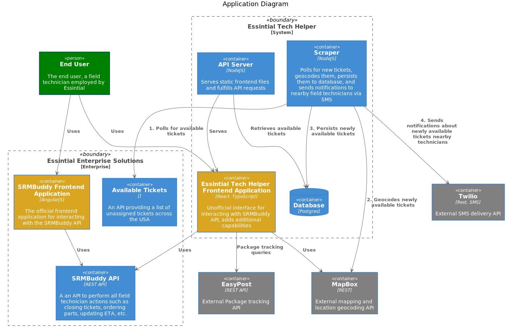

# Essintial Tech Helper

Essintial Tech Helper (ETH) is a system designed to support the [`workflow`](docs/TechnicianWorkflow.md) of IT field technicians employed by Essintial Enterprise Solutions (Essintial). 

****

**Index:**

1.  [`Features`](#features)
1.  [`System Components`](#system-components)
1.  [`Tech Stack`](#essintial-technology)
1.  [`Developer Environment`](#essintial-technology)
1.  [`Deployment`](#essintial-technology)
1.  [`Glossary`](#glossary)

****

## Features

ETH unifies _and improves_ the following features that are provided from Essintial as separate tools:
- Available tickets
   
   Essintial provides the list of available tickets via a homegrown web based report server. The report server interface is slow and not mobile friendly, making it difficult for technicians to browse in the field.
   
   - Improvement: Available tickets are provided instantly in a responsive, mobile friendly interface 
   - Improvement: Available tickets can be browsed on a map, the original tool has no mapping capability
   - Improvement: Techs can be notified of nearby tickets via SMS, instead of having to manually check the report server throughout the day
- Ticket management

    Essintial provides a very clunky web app called SRMBuddy to manage tickets. It is extremely slow with a very poorly designed interface. Almost every action requires scrolling through a dropdown menu, even if that dropdown menu only contains 1 option. 

   - Improvement: Assigned tickets can be browsed on a map, the original tool has no mapping capability
   - Improvement: Assigned tickets can be filtered by status (Assigned, Committed, Completed) and type (Project Work)
   - Improvement: tracking of parts deliveries is directly integrated into ticket management, instead of directing techs to check tracking on FedEx.com
   - Improvement: much cleaner interface, much faster access to ticket management actions
   - Improvement (coming soon): Assigned tickets can be sorted by SLA, city, or other attribute. Currently hardcoded to sort by ETA.
      
- Parts catalog (coming soon)
   
   The Essintial parts catalogue is provided as an Excel spreadsheet, making it very impractical to find part numbers on a mobile device. Techs are responsible for ordering parts for their tickets.

   - Improvement: Part numbers and names are searchable, and can be accessed directly from the parts details on a ticket. 

## System Components



The system is comprised of the Essintial Tech Helper components, the Essintial Enterprise Solutions components, and third party APIs. 

- Essintial Tech Helper

  - Database 

     Stores the list of available tickets retrieved by the scraper. 

  - Scraper 

    Scrapes and persists the Available Tickets Report, sends SMS notifications. 
   
       1. The available tickets report report is an SPA, so ETH scrapes the backing API on an interval to get all tickets available in a state. This is currently hardcoded to scrape just California but will be expanded to cover all states where Essintial is active. 
       1. The database is queried to determine which tickets are newly listed. New tickets are geocoded using the **MapBox geocoding API**. 
       1. Geocoded tickets are persisted to the database and any tickets not currently visible on the report are marked as such in the database.  
       1. Based on geocoded location, the scraper sends an SMS message via the **Twilio Messaging API** to nearby techs. This is currently hardcoded to notify just myself of any ticket within 150 miles of San Francisco. This will be expanded to allow any tech to subscribe/unsubscribe in any area and set their notification radius. 

  - API Server 

      - Serves the static frontend SPA files
      - Serves the list of available tickets from the database when requested by the frontend application
      - Proxies **EasyPost API** requests from the SPA and adds the EasyPost API token. This is done for security so the token is not embedded in the frontend application. 

  - Frontend Application 

     The frontend application is the Techs's interaction point and is designed to replace SRMBuddy. 
   
     - Requests available tickets from API server, display them in text form and on a MapBox map
     - Interacts with the official SRMBuddy API to manipulate tickets and parts.  Displays assigned tickets in text form and on a MapBox map
     - Retrieves parts information for tickets, retrieve parts tracking information from the EasyPost API and displays it inline

- Essintial Enterprise Solutions

    - Available tickets report
   
       The list of available tickets is provided as a report on a website that works very poorly on mobile devices. Techs are expected to check it regularly so they can request work via Slack chat with dispatchers. There are no filters and the only grouping is by US state. 
   
    - SRMBuddy
    
       SRMBuddy is the web interface that techs use to interact with tickets. Techs can view ticket details, order and consume parts, check in and out of sites, etc. SRMBuddy is the only way a tech can interact with a ticket, besides asking a dispatcher.
       
    - SRMBuddy API
    
        The SRMBuddy API is what backs SRMBuddy and provides all actual functionality. By reverse engineering this API it is possible to create our own frontend. 


## Tech Stack

- Frontend: TypeScript, React, Redux, Mapbox, TailwindCSS
- Backend: Node, TypeScript, Fastify, Mapbox, Twilio, EasyPost
- Database: PostgreSQL
- Deployment: Kubernetes with Helm Charts

## Developer Environment

The developer's local environment is expected to have Node, Yarn (NPM probably works), Docker, and Docker Compose. 

To run the code locally, starting from the project root:

Start the local database server: 
```
docker-compose up
```

Create the backend .env file, which you will need to fill with your values
```
cd packages/backend
cp .env.schema .env
```

Start the backend:
```
cd packages/backend
yarn install
yarn run poll-dev
yarn run server-dev
```

Start the frontend:
```
cd packages/frontend
yarn install
yarn dev
```

## Glossary

- Ticket: a unit of work for a field technician. It includes information such as client name, address, scope of work, and hardware description. 
